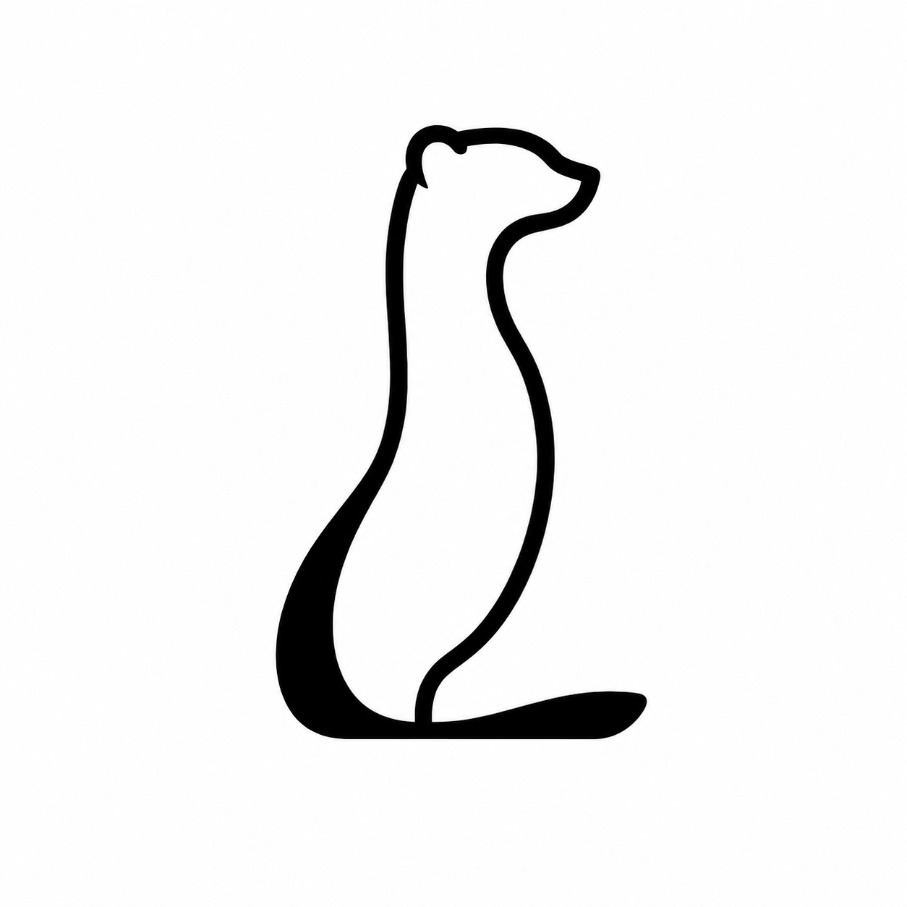
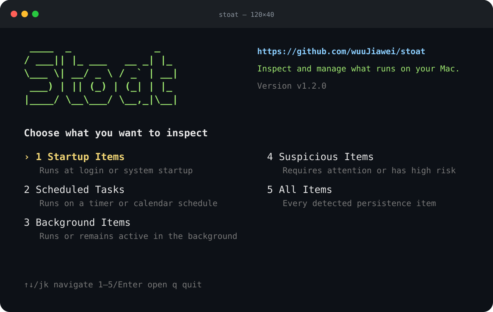

<!-- markdownlint-disable-file MD013 MD033 MD041 -->

<p align="center">
  <a href="README.md">中文</a> | <strong>English</strong>
</p>

<div align="center">
  
  <h1>Stoat</h1>
  <p><em>See and manage everything that starts automatically on your Mac.</em></p>
</div>

<p align="center">
  <a href="https://github.com/wuuJiawei/stoat/releases"></a>
  <a href="https://github.com/wuuJiawei/stoat/actions/workflows/ci.yml"></a>
  <a href="https://github.com/wuuJiawei/stoat/blob/main/go.mod"></a>
  <a href="LICENSE"></a>
  
</p>

Stoat is a security-first macOS persistence inspector and manager. It brings login items, `launchd` jobs, background tasks, and scheduled jobs into one view, explains where they came from and whether they are running, and provides controlled disable, enable, quarantine, removal, and recovery actions.

> Stoat provides evidence for review. It is not a malware scanner and does not treat a high-risk score as proof of malware.

<p align="center">
  
</p>

## Features

- **Unified discovery**: Scan Login Items, Background Task Management, LaunchAgents, LaunchDaemons, and cron.
- **Evidence-based attribution**: Explain ownership with `.app` paths, `Info.plist`, signatures, file attributes, and live `launchctl` state.
- **Interactive management**: Navigate through category, list, detail, and action screens; disable, enable, quarantine, remove a startup item, or uninstall an attributed application.
- **Terminal landing screen**: Show the Stoat logo, project URL, current version, and a non-blocking update notice when a newer release is available.
- **Change tracking**: Save snapshots, compare configuration changes, retain event history, and combine runtime state with Unified Log diagnostics.
- **Safe actions**: Strong confirmation, private backups, post-action verification, audit records, and rollback on failure; applications move to Trash.
- **Automation friendly**: Table, JSON, CSV, and JSON event-stream output on Intel and Apple Silicon Macs.

## Quick Start

### Install

```bash
curl -fsSL https://raw.githubusercontent.com/wuuJiawei/stoat/main/scripts/install.sh | sh
```

The installer detects `arm64` / `amd64`, verifies SHA-256, and atomically installs Stoat to `~/.local/bin/stoat`. If the directory is not on your `PATH`:

```bash
echo 'export PATH="$HOME/.local/bin:$PATH"' >> ~/.zshrc
source ~/.zshrc
```

### Run

```bash
stoat
```

Inside the interactive interface:

- Use the arrow keys or `1`–`5` to choose a category.
- Press `Enter` to open a list or detail view and `a` to open the action menu.
- Press `Esc` to move back. Removal and uninstall require explicit confirmation words.

Run the installer again to upgrade; uninstalling the previous version is not required.

Stoat supports only the `raw.githubusercontent.com` installation entrypoint shown above.

## Common Commands

```bash
# Inspect
stoat startup                    # Login and boot startup items
stoat scheduled                  # Scheduled jobs
stoat background                 # Background items
stoat suspicious                 # Items that deserve priority review
stoat inspect <id-or-label>      # Full item details

# Manage: the first call prints a plan and one-time confirmation token
stoat disable <id-or-label>
stoat disable <id-or-label> --confirm <token>
stoat enable <id-or-label>
stoat quarantine <id-or-label>
stoat remove <id-or-label>       # Remove config and keep recovery backup
stoat uninstall <id-or-label>    # Move the attributed app to Trash
stoat restore <operation-id>

# Observe and export
stoat scan --json
stoat snapshot --output before.json
stoat diff --json before.json after.json
stoat watch --interval 30s
stoat changes --limit 50
stoat diagnose <id-or-label> --last 1h
stoat export --format csv --output stoat-report.csv
```

Run `stoat --help` for the complete command reference.

## Security Design

Stoat reads several macOS persistence sources but does not allow changes to all of them:

- Scanning is read-only by default. State changes support non-Apple launchd jobs only.
- Stoat does not modify the private BTM database, rewrite crontabs, or operate on `/System/Library` jobs.
- It never calls `sudo` or invokes system commands through a shell. System-level actions require the process to already be root.
- Every action binds the item ID, configuration digest, and observed runtime state; a later change invalidates the old token.
- Stoat creates a protected backup before mutation, verifies the result, and writes an audit record. It restores configuration and runtime state on failure.
- Uninstall supports only attributed top-level `.app` bundles under `/Applications` or `~/Applications`. It never guesses or deletes caches, settings, accounts, or other user data.
- External commands, file sizes, output, and full scans are bounded and time-limited. A failing source returns a warning without hiding other results.

See [SECURITY.md](SECURITY.md) and [docs/SAFE_ACTIONS.md](docs/SAFE_ACTIONS.md) for the threat model and recovery protocol.

## Compatibility and Data

- Target: macOS 13+; CI validates macOS 14 and 15.
- Architectures: Apple Silicon (`arm64`) and Intel (`amd64`).
- Private state: `~/Library/Application Support/Stoat`.
- Snapshot diff tracks persistent configuration, signing, attribution, and disabled state. It does not treat PID or transient running state as configuration changes.
- Parts of `sfltool dumpbtm` and `launchctl` diagnostics are not stable public formats. Parsers consume known fields and tolerate unknown ones.

## Documentation

- [Project scope](docs/PROJECT.md)
- [Architecture](docs/ARCHITECTURE.md)
- [Risk policy](docs/RISK_POLICY.md)
- [Monitoring and change history](docs/MONITORING.md)
- [Compatibility](docs/COMPATIBILITY.md)
- [Roadmap](docs/ROADMAP.md)
- [Contributing](CONTRIBUTING.md)

## Acknowledgements

Special thanks to [tw93/Mole](https://github.com/tw93/Mole). Stoat was inspired by Mole's terminal-first product presentation, TUI interaction, safety-first defaults, and open-source maintenance practices.

Mole focuses on macOS cleanup, uninstallation, and system maintenance. Stoat focuses on discovering, explaining, and safely managing persistence items. They solve different problems, and Stoat's code, domain model, and safe-action protocol are independently implemented.

Thanks also to [Bubble Tea](https://github.com/charmbracelet/bubbletea) and everyone who contributes feedback, testing, and code.

## License

[MIT](LICENSE) © Stoat contributors
